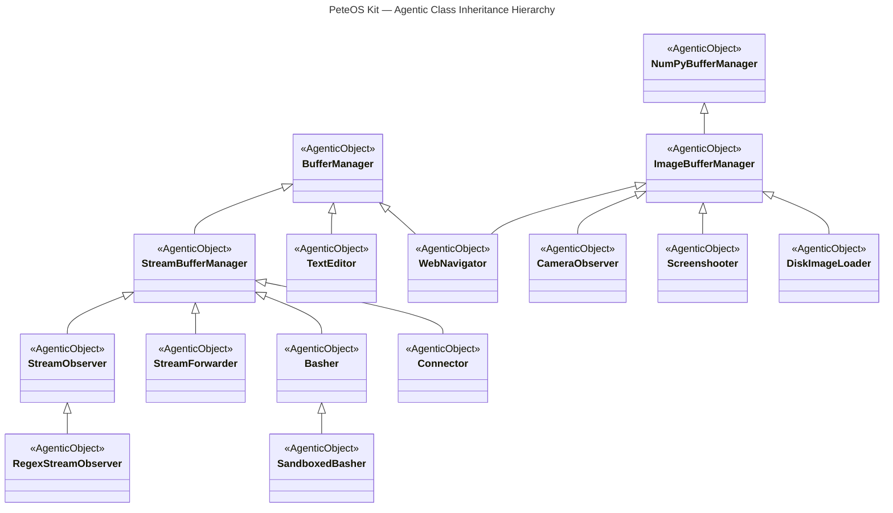

# PeteOS Kit

A collection of PeteOS agentic building blocks for streams, text, and images.

PeteOS Kit provides ready-to-use agentic objects you can inherit, compose, and deploy without building from scratch.

## Subpackages

- **`peteos_kit.stream`** — stream buffering, pattern matching, shell execution, and network connections
- **`peteos_kit.text`** — buffer management, text editing, and web navigation
- **`peteos_kit.image`** — image buffers, camera observation, and screen capture

## Quick Start

```python
from peteos import AgenticObject
from peteos_kit import RegexStreamObserver, StreamForwarder

# Create a composed agent
class LogMonitor(RegexStreamObserver, StreamForwarder, AgenticObject):
    """You monitor log streams for patterns and forward interesting entries."""

# Use it
monitor = LogMonitor()
result = await monitor.invoke_agent("Set up a pattern for ERROR messages in my syslog stream.")
print(result)
```

## Key Components



- **`BufferManager`** — in-memory text buffers with search, diff, and edit
- **`StreamBufferManager`** — rolling, append-only stream buffers with rule-based routing
- **`StreamObserver`** — observes streams and surfaces unexpected entries to the agent
- **`RegexStreamObserver`** — regex-based pattern matchers as conditions for stream rules
- **`TextEditor`** — file editing backed by a multi-file buffer
- **`WebNavigator`** — web navigation backed by a buffer
- **`ImageBufferManager`** — numpy-backed image buffers
- **`CameraObserver`** — multi-camera observation with buffer management
- **`Screenshooter`** — screen capture into image buffers
- **`DiskImageLoader`** — load and save image buffers to and from disk
- **`Basher`** / **`SandboxedBasher`** — shell execution with buffer integration

## Installation

```bash
python -m venv .venv
source .venv/bin/activate
pip install peteos_kit
```

For image processing support:

```bash
pip install peteos_kit[image]
```

## Configuration

PeteOS Kit requires a working `peteos.json` in your project root or config directory. See the [PeteOS configuration docs](https://docs.peteos.ai/0.3.x/docs/config/) for details.

## Resources

- [PeteOS](https://peteos.ai) — the underlying framework
- [PeteOS on GitHub](https://github.com/Schafer-List-Systems/peteos) — PeteOS framework source
- [PeteOS Docs](https://docs.peteos.ai/0.3.x/docs/) — concepts, reference, and best practices
- [PeteOS Kit on GitHub](https://github.com/Schafer-List-Systems/peteos_kit) — source and issues

## Licensing

This project is MIT-licensed. See the [LICENSE](LICENSE) file for details.
